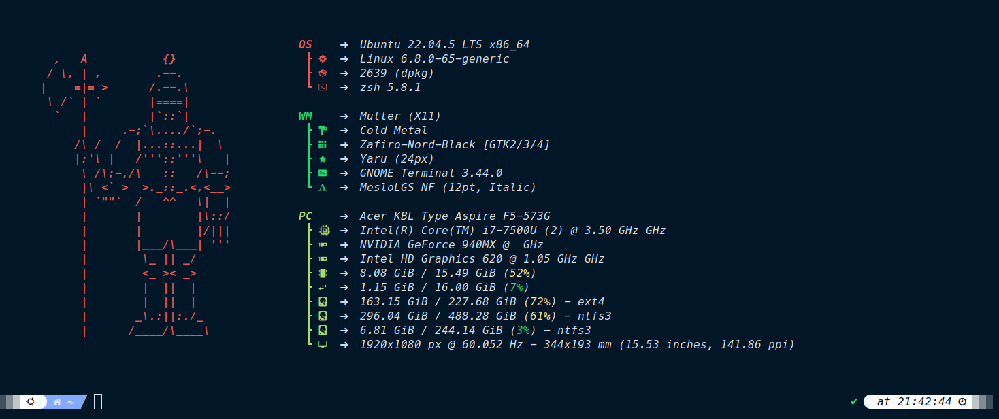

# 🚀 Interactive System Setup Script

## 🎨 Final Result



*Your terminal after running the setup script - featuring Zsh with Powerlevel10k theme, Fastfetch system info, and modern CLI tools*

---

An interactive bash script to quickly set up and configure a modern Linux development environment with your preferred tools and configurations.

## ✨ Features

This setup script provides an interactive installation experience for:

- 🦀 **Rust & Cargo Tools** - Modern command-line utilities
- ⚡ **Fastfetch** - System information display tool
- 🐚 **Zsh & Oh My Zsh** - Enhanced shell experience
- 🖥️ **GNOME Terminal** - Custom terminal configurations
- 📝 **Helix Editor** - Modern text editor

## 🛠️ What Gets Installed

### Core Tools
- **Rust & Cargo** - Rust programming language and package manager
- **Zsh** - Z shell with Oh My Zsh framework
- **Git, curl, fonts-powerline** - Essential development tools
- **dconf-cli** - Configuration management

### Rust-based CLI Tools (Optional)
- **eza** - Modern replacement for `ls`
- **tlrc** - Fast tldr client for command examples
- **du-dust** - Intuitive disk usage analyzer
- **procs** - Modern replacement for `ps`
- **navi** - Interactive cheatsheet tool

### System Tools
- **Fastfetch** - System information fetcher
- **Helix** - Post-modern text editor

## 📁 Required Directory Structure

Ensure your project has the following structure before running the script:

```
your-project/
├── setup.sh
├── fastfetch/
│   ├── config.jsonc
│   └── ascii/
│       └── samurai.txt
├── zsh-config/
│   ├── .zshrc
│   ├── .p10k.zsh
│   ├── custom/
│   └── fonts/
│       └── *.ttf or *.otf files
└── gnome-terminal-backup/
    ├── terminal-settings.dconf
    └── fonts/
        └── *.ttf or *.otf files
```

## 🚀 Quick Start

1. **Clone or download** this repository
2. **Make the script executable**:
   ```bash
   chmod +x setup.sh
   ```
3. **Run the script**:
   ```bash
   ./setup.sh
   ```
4. **Follow the interactive prompts** to choose which components to install

## 📋 Installation Sections

The script will prompt you for each section:

### 1. 🦀 Rust Installation
- Installs Rust and Cargo
- Offers optional modern CLI tools built in Rust

### 2. ⚡ Fastfetch Setup
- Installs system information tool
- Configures with custom ASCII art and settings

### 3. 🐚 Zsh Configuration
- Installs Zsh and Oh My Zsh
- Restores custom configurations and themes
- Installs Nerd Fonts
- Optionally sets Zsh as default shell

### 4. 🖥️ GNOME Terminal
- Restores saved terminal profiles and settings
- Applies custom color schemes and fonts

### 5. 📝 Helix Editor
- Installs modern text editor
- Adds necessary PPA repository

## 🎛️ Interactive Features

- **User Choice**: Each section can be skipped if not needed
- **Smart Dependencies**: Rust tools only offered if Rust is installed
- **Safe Operations**: Backup files are preserved with warnings if missing
- **Progress Feedback**: Clear status messages throughout installation

## 📝 Configuration Files

### Fastfetch
- Configuration: `~/.config/fastfetch/config.jsonc`
- ASCII Art: `~/.config/fastfetch/ascii/`

### Zsh
- Main config: `~/.zshrc`
- Powerlevel10k theme: `~/.p10k.zsh`
- Custom themes/plugins: `~/.oh-my-zsh/custom/`

### Fonts
- Installed to: `~/.local/share/fonts/`
- Automatically refreshes font cache

### GNOME Terminal
- Settings restored via dconf from backup file

## 🔧 Requirements

- **Ubuntu/Debian-based** Linux distribution
- **sudo privileges** for package installation
- **Internet connection** for downloading packages and Rust tools
- **GNOME Terminal** (for terminal configuration section)

## 🚨 Important Notes

- The script uses `set -e` to exit on any error
- **Restart your terminal** after installation for changes to take effect
- If Zsh is installed, run `zsh` to start using it immediately
- Some changes require **logout/login** to fully take effect

## 🛡️ Safety Features

- **Non-destructive**: Only copies files, doesn't overwrite without confirmation
- **Error handling**: Shows warnings for missing configuration files
- **User control**: Each section is optional and can be skipped

## 📖 Usage Examples

```bash
# Run the full interactive setup
./setup.sh

# The script will ask for each component:
# 🦀 Do you want to install Rust and Cargo? (y/n): y
# 📂 Do you want to install eza (modern ls replacement)? (y/n): y
# ⚡ Do you want to install and configure Fastfetch? (y/n): n
# 🐚 Do you want to install and configure Zsh with Oh My Zsh? (y/n): y
```

## 🤝 Contributing

1. Fork the repository
2. Create your feature branch (`git checkout -b feature/amazing-feature`)
3. Commit your changes (`git commit -m 'Add some amazing feature'`)
4. Push to the branch (`git push origin feature/amazing-feature`)
5. Open a Pull Request

## 📄 License

This project is open source and available under the [MIT License](LICENSE).

## 🙏 Acknowledgments

- [Oh My Zsh](https://ohmyz.sh/) - Framework for managing Zsh configuration
- [Powerlevel10k](https://github.com/romkatv/powerlevel10k) - Zsh theme
- [Fastfetch](https://github.com/fastfetch-cli/fastfetch) - System information tool
- [Rust](https://www.rust-lang.org/) - Systems programming language
- All the amazing Rust CLI tool developers

## 📞 Support

If you encounter any issues or have questions:

1. Check the [Issues](../../issues) section
2. Create a new issue with detailed information about your problem
3. Include your Linux distribution and version

---

**Happy coding!** 🎉